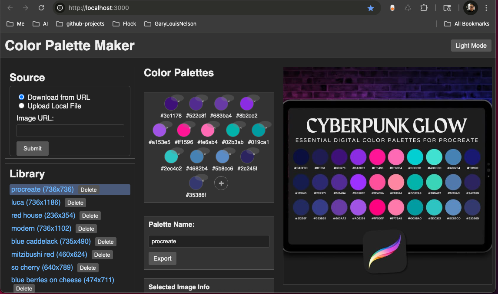

# Color Palette Maker (React)

A React-based single-page application for extracting and managing color palettes from images. Upload images via URL or file, extract dominant colors using K-means clustering, and export palettes as JSON.



## Features

- **Image Sources**: Upload images from URL or local file
- **Automatic Palette Extraction**: K-means clustering extracts up to 5 dominant colors
- **Color Sampling**: Click to sample colors directly from the image and add to the palette
- **Palette Management**: Rename palettes, delete individual swatches, export as JSON
- **Theme Toggle**: Light and dark mode support
- **Image Library**: Browse, select, and delete stored images

## Tech Stack

- **Frontend**: React 19, Vite 7
- **Backend**: Node.js, Express
- **Image Processing**: Sharp, node-kmeans, get-pixels
- **Testing**: Vitest, React Testing Library, happy-dom

## Prerequisites

- Node.js 18+ (20.19+ or 22.12+ recommended for Vite 7)
- npm or yarn

## Installation

```bash
# Install root dependencies (backend + dev tools)
npm install

# Install client dependencies (React app)
cd client && npm install && cd ..
```

## Development

Run both the backend server and React dev server:

```bash
npm run dev
```

This starts:
- **Backend**: http://localhost:3000 (Express API)
- **Frontend**: http://localhost:5173 (Vite dev server with hot reload)

The Vite dev server proxies `/api`, `/upload`, and `/uploads` to the backend.

To run them separately:

```bash
# Terminal 1: Backend only
npm run dev:server

# Terminal 2: Frontend only
npm run dev:client
```

## Production Build

```bash
# Build the React app
npm run build

# Start the server (serves built React app + API)
npm start
```

The server will serve the React app from `client/dist` and the API at the same origin.

## Testing

```bash
# Run tests once
npm test

# Run tests in watch mode (from client directory)
cd client && npm run test:watch
```

Tests cover:
- Utility functions (filename parsing, file size formatting, RGB to hex)
- API client (request methods and payloads)
- React components (Header, etc.)

## Project Structure

```
color-palette-maker-react/
├── client/                 # React frontend (Vite)
│   ├── src/
│   │   ├── components/     # React components
│   │   ├── api.js         # API client
│   │   ├── utils.js       # Helper functions
│   │   ├── App.jsx
│   │   └── main.jsx
│   ├── vite.config.js
│   └── package.json
├── server.js              # Express server
├── metadata_handler.js    # Image metadata (JSONL)
├── image_processor.js     # K-means palette generation
├── uploads/               # Uploaded images
└── package.json
```

## API Endpoints

| Method | Endpoint | Description |
|--------|----------|-------------|
| GET | `/api/images` | List all images with metadata |
| POST | `/upload` | Upload image (file or URL) |
| POST | `/api/palette/:filename` | Generate color palette for image |
| PUT | `/api/palette/:filename` | Save updated palette |
| PUT | `/api/metadata/:filename` | Update palette name |
| DELETE | `/api/images/:filename` | Delete image and metadata |

## License

MIT
